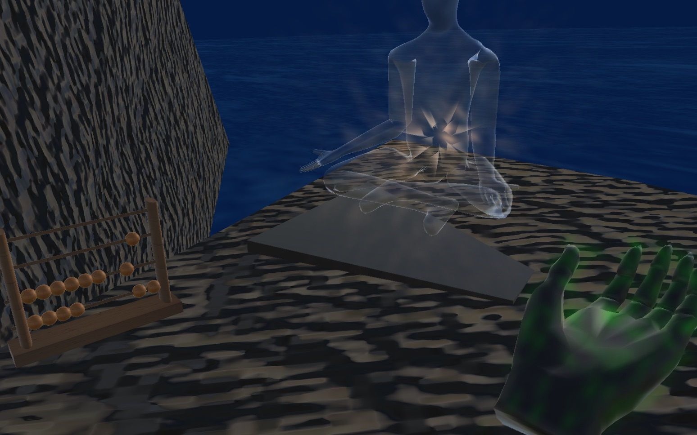

# Biofield VR

By [Lewey Geselowitz](https://lewcid.com/lg/aboutme.html) based on [Lewey's Energy Work Experiences](https://lewcid.com/lg/articles/leweys_energy_work.html).

# Chi and Chakra Visualization 

For those curious to see what the "chi" looks like around your hands, or how the auras circulate into the vortices known as chakras, this visually guided mediation was created. It even works on VR headsets so that you can see the swirling energies in front of you. 

Down and to the your right you will find a virtual book, turning the pages will switch between mediation excersizes. 

To your left you will see a second character, as you look (point your head/eyes) to different parts of the chakras of the body the energy will be activated there. To your far left you will find an abcus that can be used as a timer.

## [Experience it in on the Web](https://leweyg.github.io/vrbiofield/webxr/BiofieldWebXR/index.html)

Demo page: https://leweyg.github.io/vrbiofield/webxr/BiofieldWebXR/index.html 

Older WebGL Version - https://leweyg.github.io/vrbiofield/web3d/index.html

Windows/Mac/PC-VR Demos - https://github.com/leweyg/vrbiofield/releases

## Software Credits

By Lewey Geselowitz - https://lewcid.com/lg/aboutme.html

Unity Engine - https://unity.com/ (mostly built in this)

MagnetoDynamics - http://coffeeshopphysics.com/magnetodynamics/ (used in the initial chi simulation)

Unity WebXR Export - https://github.com/De-Panther/unity-webxr-export

## Development Screenshots

I started by modelling the energy around my head as a vector field:

Then building a mixture of particle and iso-surface simulations for the chakras:

Then all the chakras as the meditation environment:

Finally a virtual book you can turn the pages of by looking at, which selects different mediations:

Developer:
Lewey Geselowitz - https://lewcid.com/lg/aboutme.html

